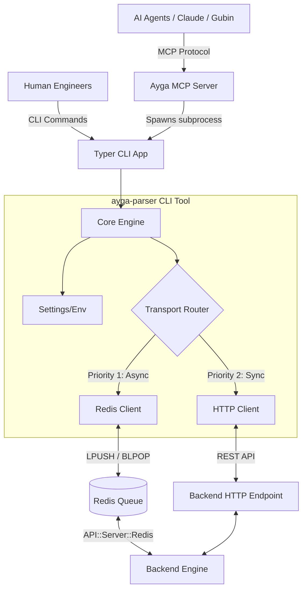

# System Architecture
# ayga-parser CLI & MCP Integration

**Date:** 2026-03-07
**Version:** 1.0

## 1. High-Level Architecture

The system acts as a middleware bridge connecting AI Agents (via MCP) and Human operators (via CLI) to the backend engine.
It uses a Dual-Transport mechanism to ensure high throughput (Redis) with a reliable fallback (HTTP).

## 2. Core Components

### 2.1 CLI Layer (`ayga_cli.main`)
- Framework: **Typer** (FastAPI's sister framework for CLI).
- Handles input parsing, command routing, and interactive prompts.

### 2.2 Transport Router (`ayga_cli.client`)
- Determines the best way to execute a command based on availability and requested mode (`--async` vs `--sync`).
- **Redis Transport:** Uses `redis-py` (async) to push `{"password": "", "action": "request", "data": {...}}` into the `ayga-parser_redis_api` queue.
- **HTTP Transport:** Uses `httpx` to POST JSON to `http://127.0.0.1:9091/API`.

### 2.3 MCP Bridge (`ayga-parser_mcp`)
- Will utilize standard `@mcp.tool()` decorators.
- Transforms complex JSON configurations for parsers into flat, natural-language-friendly parameters understandable by LLMs.

## 3. Data Flow: Typical Parsing Job

1. AI Agent decides to scrape 100 links to find contacts.
2. AI calls `mcp.tool(parser="SE::Google", queries=[...])`.
3. MCP Server executes: `ayga-parser redis push SE::Google --queries-file ...`
4. CLI pushes JSON payload to Redis `ayga-parser_redis_api`.
5. CLI immediately returns a `queryId` to the AI agent.
6. The backend picks up the job from Redis, processes it using 100 threads.
7. The backend pushes results to `ayga-parser_results` queue.
8. A separate Cron job or the AI Agent (via `ayga-parser task wait <queryId>`) pops the result.
9. Data is cleaned and returned to the text context.

## 4. Key Technology Choices

- **Python 3.12+**: asyncio natively supported.
- **Typer**: Type-safe, auto-generates `--help` docs.
- **Rich**: For rendering beautiful tables and progress bars in terminal.
- **Pydantic**: For strict validation of parser parameters.
- **aioredis & httpx**: For non-blocking I/O.
